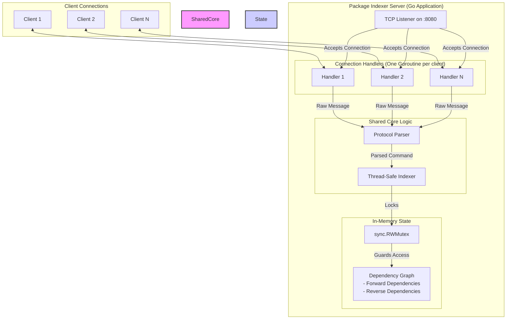

# Synthesized Project Plan: Concurrent Package Indexer (V1)

## 1. Executive Summary

This document presents a synthesized, comprehensive plan to design, implement, and deliver a production-ready concurrent package indexer as required by the DigitalOcean coding challenge. This plan is the result of analyzing three distinct AI-generated proposals, combining the unanimous core technical strategy with the unique analytical strengths of each.

The proposed solution is a **stateful TCP server written in Go**, chosen for its superior concurrency model and robust standard library. The architecture is centered on a thread-safe, in-memory dependency graph. The implementation will be guided by a deep analysis of the provided test harness to ensure robustness and full compliance with the success criteria. The final deliverables will include thoroughly tested source code, a containerized deployment using Docker, and comprehensive documentation.

## 2. System and State Analysis

### 2.1. The System: A Concurrent Dependency Graph Manager

The target system is a TCP server that acts as a centralized, stateful service for managing software package dependencies. It must:
- Listen on TCP port `8080`.
- Handle numerous concurrent clients, each sending a sequence of commands.
- Process commands (`INDEX`, `REMOVE`, `QUERY`) according to strict dependency rules.
- Maintain a consistent, in-memory dependency graph across all connections.
- Adhere precisely to a `command|package|dependencies\n` protocol, including newline terminators.

### 2.2. Current State: Green Field with a High-Quality Test Suite

The project is at its inception. The repository contains:
- **`INSTRUCTIONS.md`**: The complete functional specification.
- **Test Harness Binaries**: (`do-package-tree_*`) for multiple platforms.
- **`source.tar.gz`**: The Go source code for the test harness.

### 2.3. Key Insight: Test Harness Deep Analysis

A crucial preparatory step is analyzing the test harness source code. This reveals the exact evaluation criteria:
- **Real-World Data**: The harness uses an embedded dataset of real **Homebrew package dependencies**, meaning the system must handle a complex, authentic dependency graph.
- **5-Phase Testing Strategy**: The test runs in a distinct sequence:
    1.  **Cleanup**: Tries to `REMOVE` all packages to ensure a clean slate.
    2.  **Brute-Force Indexing**: Repeatedly sends `INDEX` commands for all packages until the dependency graph is fully resolved and built.
    3.  **Verification**: `QUERY`s all packages, expecting `OK` for each.
    4.  **Coordinated Removal**: `REMOVE`s all packages in a dependency-safe order.
    5.  **Final Verification**: `QUERY`s all packages again, expecting `FAIL`.
- **Robustness and "Unluckiness"**: The harness intentionally injects chaos. It will send malformed commands, violate the protocol, and simulate random client disconnections to test the server's resilience.

This knowledge confirms that the server must not only be correct but also extremely robust and performant under chaotic, high-concurrency conditions.

## 3. Proposed Solution and Architecture

### 3.1. Language Choice: Go (Golang)

Go is the ideal choice. All analyses converged on this conclusion due to its native support for concurrency (goroutines), an excellent standard library for networking (`net`), and its ability to compile to a single, easily deployable static binary.

### 3.2. High-Level Architecture

The architecture will be clean and modular, separating concerns to enhance maintainability and testability.



### 3.3. Core Data Structures and Concurrency

The heart of the server is the in-memory index. It will be implemented in a dedicated `Indexer` struct.

```go
// Package indexer contains the core thread-safe data structures.
package indexer

import "sync"

// Indexer holds the dependency graph and manages concurrent access.
type Indexer struct {
	mu           sync.RWMutex
	dependencies map[string]map[string]struct{} // Package -> its dependencies
	dependents   map[string]map[string]struct{} // Package -> packages that depend on it
}
```
- **`dependencies`**: Provides O(1) lookup for a package's dependencies, required for the `INDEX` command's core logic.
- **`dependents`**: The reverse dependency graph. This is the critical optimization for the `REMOVE` command, allowing an O(1) check to see if any other packages depend on the package being removed.
- **`sync.RWMutex`**: A read-write mutex is perfect for this use case. It allows for any number of concurrent `QUERY` operations (read lock) but ensures that `INDEX` and `REMOVE` operations (write lock) have exclusive, atomic access, preventing race conditions.

## 4. Detailed Implementation Plan

The project will be executed in five distinct phases.

### Phase 1: Foundation and Core Logic
- **Goal**: Build the thread-safe brain of the application.
- **Tasks**:
    1.  Initialize a Git repository and configure it for **anonymous commits**.
    2.  Set up a standard Go module structure (`cmd/server`, `internal/indexer`, `internal/server`).
    3.  Implement the `Indexer` struct and its core methods: `Index()`, `Remove()`, and `Query()`.
    4.  Write comprehensive unit tests for the `Indexer`. These tests must be run with the `-race` flag to prove thread-safety and must cover all logical edge cases (e.g., re-indexing, removing a dependency, removing a non-existent package).

### Phase 2: TCP Server and Protocol Handling
- **Goal**: Expose the core logic over the network.
- **Tasks**:
    1.  Implement the main server that listens on TCP port `8080`.
    2.  Implement the connection handler function that spawns a goroutine for each new client.
    3.  Implement a robust protocol parser that safely handles both valid and malformed messages.
    4.  Connect the server to the `Indexer`, translating protocol commands into method calls and results back into protocol responses (`OK\n`, `FAIL\n`, `ERROR\n`).

### Phase 3: Integration and Harness Validation
- **Goal**: Ensure the server meets the exact requirements of the challenge.
- **Tasks**:
    1.  Write a small suite of integration tests that connect to the server over a real TCP socket and verify command flows.
    2.  Run the official `do-package-tree` test harness against the server.
    3.  Iteratively debug and refine the implementation until the harness passes with a concurrency of 1 (`-c=1`).
    4.  Increase the concurrency factor up to 100, identify and fix any race conditions or performance bottlenecks that emerge. This must pass consistently across multiple random seeds.

### Phase 4: Production Readiness
- **Goal**: Package the application for easy deployment and review.
- **Tasks**:
    1.  Create a multi-stage `Dockerfile` that builds the Go binary in a build container and copies it into a minimal production `ubuntu` image.
    2.  Create a `Makefile` with targets for `build`, `test`, `run`, and `docker-build`.
    3.  Write a clear, concise `README.md` that explains the design rationale and provides instructions for building and running the project.

### Phase 5: Final Review
- **Goal**: Perform a final quality check.
- **Tasks**:
    1.  Review all code for clarity, maintainability, and adherence to Go best practices.
    2.  Ensure all deliverables are present and correct.
    3.  Verify that no personally identifiable information is present in the code or Git history.

## 5. Risk Assessment and Mitigation

| Risk Description | Likelihood | Impact | Mitigation Strategy |
| :--- | :--- | :--- | :--- |
| **Race Conditions in State** | Medium | High | Use `sync.RWMutex` for all access to the shared index. Validate exhaustively with the `-race` detector and high-concurrency harness runs. |
| **Deadlock** | Low | High | Use a single global lock to avoid complex lock ordering issues. If performance requires finer-grained locking, a strict lock acquisition order must be enforced. |
| **Protocol Edge Cases** | High | Medium | Implement a defensive parser. Write extensive unit tests for the parser covering malformed messages, partial reads, and invalid command sequences. |
| **Resource Leaks** | Medium | Medium | Ensure every accepted connection has a clear path to being closed, and every spawned goroutine is guaranteed to exit. Use `defer` statements for cleanup. |

This synthesized plan provides a robust and comprehensive roadmap to successfully completing the challenge. It is built on a consensus of best practices and fortified with deep, specific analysis of the evaluation criteria.
