# Package Indexer - Complete Sequence Diagram

This diagram provides a comprehensive trace of every function call in the package indexer solution, from server startup through client interactions to graceful shutdown.

## Overview

The sequence diagram captures:
- **Server Startup Phase**: Command-line parsing (including timeout configuration), context setup, signal handling, TCP listener initialization, and optional admin server startup
- **Connection Handling Phase**: Accept loop, per-connection goroutines, and lifecycle management  
- **Message Processing**: Protocol parsing, command validation, and business logic execution
- **Core Operations**: INDEX (dependency validation), REMOVE (dependent checking), QUERY (lookup)
- **Admin Server Operations**: Optional HTTP endpoints for health checks, Prometheus metrics, build info, and pprof debugging
- **Structured Logging**: JSON-formatted logs with contextual fields (connID, clientAddr) using slog
- **Graceful Shutdown Phase**: Context cancellation, connection cleanup, and coordinated shutdown of both servers

## Technical Precision

Every major function call is represented in execution order:
- `main()` → `run()` → `server.NewServer()` → `server.StartWithContext()`
- Optional observability: `startAdminServer()` → HTTP endpoints setup
- Connection lifecycle: `Accept()` → `handleConnection()` → `serveConn()`
- Message processing: `ReadString()` → `processCommand()` → `wire.ParseCommand()`
- Business logic: `indexer.IndexPackage()` / `RemovePackage()` / `QueryPackage()`
- Response flow: `wire.Response.String()` → `conn.Write()`
- Coordinated shutdown: TCP server shutdown → Admin server shutdown

## Human Readability Features

- **Clear phases** with descriptive notes
- **Logical grouping** of related operations  
- **Alternative flows** for different command types and error conditions
- **Concurrency coordination** showing goroutines and synchronization
- **Resource management** showing cleanup and graceful shutdown

## Sequence Diagram

```mermaid
%%{init: {'theme': 'neutral'}}%%
sequenceDiagram
    participant Main as main()
    participant Run as run()
    participant Server as Server
    participant Indexer as Indexer
    participant Metrics as Metrics
    participant Admin as Admin HTTP Server
    participant Listener as TCP Listener
    participant Client as Client Connection
    participant Wire as Wire Protocol
    participant Conn as Connection Handler

    %% Startup Sequence
    Note over Main, Conn: Server Startup Phase
    Main->>Run: main() calls run()
    Run->>Run: flag.Parse() - parse command flags (-addr, -quiet, -admin, -read-timeout, -shutdown-timeout)
    Run->>Run: context.WithCancel() - create cancellable context
    Run->>Run: signal.Notify() - setup SIGINT/SIGTERM handlers
    
    %% Server Creation
    Run->>Server: server.NewServer(addr, readTimeoutFlag)
    Server->>Indexer: indexer.NewIndexer()
    Indexer->>Indexer: Initialize indexed StringSet
    Indexer->>Indexer: Initialize dependencies map[string]StringSet
    Indexer->>Indexer: Initialize dependents map[string]StringSet
    Indexer-->>Server: return *Indexer
    Server->>Metrics: NewMetrics()
    Metrics->>Metrics: time.Now() - record StartTime
    Metrics-->>Server: return *Metrics
    Server->>Server: make(chan bool) - create ready channel
    Server->>Server: store readTimeout parameter for connection handling
    Server-->>Run: return *Server

    %% Server Start
    Run->>Server: srv.StartWithContext(ctx) in goroutine
    Server->>Server: context.WithCancel(ctx)
    Server->>Listener: net.Listen("tcp", addr)
    alt Listen error
        Listener-->>Server: return error
        Server->>Server: close(ready) - unblock tests on failure
        Server-->>Run: return error
    else Listen OK
        Listener-->>Server: return net.Listener
        Server->>Server: close(ready) - signal server is ready
    end
    Server->>Server: spawn shutdown goroutine monitoring ctx.Done()

    %% Optional Admin Server Startup
    alt Admin flag provided (-admin :9090)
        Run->>Admin: startAdminServer(ctx, adminAddr, srv)
        Admin->>Admin: create HTTP ServeMux
        Admin->>Admin: mount /healthz handler (health check with actual readiness status)
        Admin->>Admin: mount /metrics handler (Prometheus format with srv.GetMetrics())
        Admin->>Admin: mount /buildinfo handler (build version and Go info as JSON)
        Admin->>Admin: mount /debug/pprof/ handler (pprof.Index)
        Admin->>Admin: mount /debug/pprof/cmdline handler (pprof.Cmdline)
        Admin->>Admin: mount /debug/pprof/profile handler (pprof.Profile)
        Admin->>Admin: mount /debug/pprof/symbol handler (pprof.Symbol)
        Admin->>Admin: mount /debug/pprof/trace handler (pprof.Trace)
        Admin->>Admin: create &http.Server{Addr: addr, Handler: mux}
        Admin->>Admin: start adminServer.ListenAndServe() in goroutine
        Admin->>Admin: slog.Info("Starting admin HTTP server", "addr", addr)
        Admin-->>Run: return *http.Server
    end

    %% Connection Accept Loop
    Note over Server, Conn: Connection Handling Phase
    loop Accept Loop
        Server->>Listener: l.Accept() - blocking wait for connections
        Note over Server: On Accept error: if ctx.Done() return, else slog.Warn() and continue
        Listener-->>Server: return net.Conn (client connection)
        Server->>Server: wg.Add(1) - track connection for graceful shutdown
        Server->>Conn: go handleConnection(conn) - spawn connection handler
        
        %% Per-Connection Processing
        Note over Conn, Wire: Individual Client Session
        Conn->>Conn: defer wg.Done()
        Conn->>Conn: defer conn.Close()
        Conn->>Server: serveConn(ctx, conn, connID)
        
        %% Connection Setup with Structured Logging
        Server->>Server: connID := atomic.AddUint64(&nextConnID, 1)
        Server->>Server: logger := slog.With("connID", connID, "clientAddr", clientAddr)  
        Server->>Server: logger.Info("Client connected")
        Server->>Metrics: IncrementConnections()
        Metrics->>Metrics: atomic.AddInt64(&ConnectionsTotal, 1)
        Server->>Server: setConnectionDeadline(conn, logger, "initial")
        Note over Server: Helper method eliminates duplicate error handling
        Server->>Conn: conn.SetReadDeadline(s.readTimeout) - set configurable timeout
        alt SetReadDeadline error
            Conn-->>Server: return error
            Server->>Server: logger.Warn("Failed to set read deadline", "error", err, "context", "initial")
        end
        Server->>Server: bufio.NewReader(conn) - create buffered reader
        Server->>Server: spawn graceful shutdown goroutine for connection
        
        %% Message Processing Loop
        loop Message Processing
            Server->>Server: setConnectionDeadline(conn, logger, "reset")
            Note over Server: Reuses helper method for consistent error handling
            Server->>Conn: conn.SetReadDeadline(s.readTimeout) - reset configurable timeout
            alt SetReadDeadline error
                Conn-->>Server: return error
                Server->>Server: logger.Warn("Failed to set read deadline", "error", err, "context", "reset")
            end
            Server->>Conn: reader.ReadString('\n') - read client message
            
            alt Message Received Successfully
                Conn-->>Server: return message line
                Server->>Metrics: IncrementCommands()
                Metrics->>Metrics: atomic.AddInt64(&CommandsProcessed, 1)
                Server->>Server: processCommand(line)
                
                %% Command Parsing
                Server->>Wire: wire.ParseCommand(line)
                Wire->>Wire: strings.HasSuffix(line, "\n") - validate newline
                Wire->>Wire: strings.Split(line, "|") - parse into parts
                Wire->>Wire: validate command type (INDEX/REMOVE/QUERY)
                Wire->>Wire: validate package name (non-empty)
                Wire->>Wire: parse dependencies (comma-separated)
                Wire->>Wire: trim spaces and ignore empty entries
                
                alt Valid Command
                    Wire-->>Server: return *Command
                    
                    %% Command Execution - INDEX
                    alt INDEX Command
                        Server->>Indexer: IndexPackage(package, dependencies)
                        Indexer->>Indexer: mu.Lock() - acquire write lock
                        Indexer->>Indexer: defer mu.Unlock()
                        
                        %% Dependency Validation
                        loop For each dependency
                            Indexer->>Indexer: indexed.Contains(dep) - O(1) lookup
                            alt Dependency Missing
                                Indexer-->>Server: return false (FAIL)
                            end
                        end
                        
                        %% Update Package State
                        Indexer->>Indexer: get oldDeps from dependencies[pkg]
                        Indexer->>Indexer: create newDeps StringSet
                        
                        %% Clean Old Dependencies
                        loop For each old dependency
                            alt No longer in new dependencies
                                Indexer->>Indexer: removeDependentReference(oldDep, pkg)
                                Indexer->>Indexer: dependents[oldDep].Remove(pkg)
                                alt Dependents set now empty
                                    Indexer->>Indexer: delete(dependents, oldDep)
                                end
                            end
                        end
                        
                        %% Add New Dependencies
                        loop For each new dependency
                            Indexer->>Indexer: initialize dependents[newDep] if nil
                            Indexer->>Indexer: dependents[newDep].Add(pkg)
                        end
                        
                        Indexer->>Indexer: indexed.Add(pkg)
                        Indexer->>Indexer: dependencies[pkg] = newDeps
                        Indexer-->>Server: return true (OK)
                        
                        Server->>Metrics: IncrementPackages()
                        Metrics->>Metrics: atomic.AddInt64(&PackagesIndexed, 1)
                        Server->>Wire: return wire.OK
                    
                    %% Command Execution - REMOVE
                    else REMOVE Command
                        Server->>Indexer: RemovePackage(package)
                        Indexer->>Indexer: mu.Lock() - acquire write lock
                        Indexer->>Indexer: defer mu.Unlock()
                        
                        %% Check if Package Indexed
                        Indexer->>Indexer: indexed.Contains(pkg)
                        alt Package Not Indexed
                            Indexer-->>Server: return RemoveResultNotIndexed
                            Server->>Wire: return wire.OK
                        end
                        
                        %% Check Dependencies
                        Indexer->>Indexer: check dependents[pkg] existence and size
                        alt Has Dependents
                            Indexer-->>Server: return RemoveResultBlocked
                            Server->>Wire: return wire.FAIL
                        end
                        
                        %% Remove Package
                        Indexer->>Indexer: indexed.Remove(pkg)
                        
                        %% Clean Forward Dependencies
                        loop For each dependency in dependencies[pkg]
                            Indexer->>Indexer: removeDependentReference(dep, pkg)
                            Indexer->>Indexer: dependents[dep].Remove(pkg)
                            alt Dependents set now empty
                                Indexer->>Indexer: delete(dependents, dep)
                            end
                        end
                        
                        Indexer->>Indexer: delete(dependencies, pkg)
                        Indexer->>Indexer: delete(dependents, pkg) - defensive cleanup
                        Indexer-->>Server: return RemoveResultOK
                        Server->>Wire: return wire.OK
                    
                    %% Command Execution - QUERY
                    else QUERY Command
                        Server->>Indexer: QueryPackage(package)
                        Indexer->>Indexer: mu.RLock() - acquire read lock
                        Indexer->>Indexer: indexed.Contains(pkg) - O(1) lookup
                        Indexer->>Indexer: mu.RUnlock()
                        
                        alt Package Found
                            Indexer-->>Server: return true
                            Server->>Wire: return wire.OK
                        else Package Not Found
                            Indexer-->>Server: return false
                            Server->>Wire: return wire.FAIL
                        end
                    end
                    
                else Invalid Command Format
                    Wire-->>Server: return error
                    Server->>Metrics: IncrementErrors()
                    Metrics->>Metrics: atomic.AddInt64(&ErrorCount, 1)
                    Server->>Wire: return wire.ERROR
                end
                
                %% Send Response
                Wire->>Wire: response.String() - format protocol response
                Wire-->>Server: return formatted response ("OK\n", "FAIL\n", "ERROR\n")
                Server->>Conn: conn.Write(response) - send to client
                alt Write error
                    Conn-->>Server: return error
                    Server->>Server: logger.Warn("Error writing response to client", "error", err)
                end
            
            else Connection Error (EOF, timeout, etc.)
                Conn-->>Server: return error
                Server->>Server: logger.Info("Client disconnected") or logger.Warn("Error reading", "error", err)
            end
        end
        
        %% Connection Cleanup
        Conn->>Conn: conn.Close() - cleanup connection resources
        Conn->>Server: wg.Done() - signal connection complete
    end
    
    %% Graceful Shutdown Sequence
    Note over Main, Conn: Graceful Shutdown Phase
    Run->>Run: stop signal received (SIGINT/SIGTERM)
    Run->>Run: context.WithTimeout(shutdownTimeoutFlag) - create shutdown context with configurable timeout
    Run->>Server: srv.Shutdown(shutdownCtx)
    Server->>Server: cancel context - signal all connections to stop
    Server->>Listener: listener.Close() - stop accepting new connections
    Server->>Server: wg.Wait() - wait for all connections to complete
    
    alt Admin server running
        Run->>Admin: adminServer.Shutdown(shutdownCtx)
        Admin->>Admin: gracefully shutdown HTTP server
        Admin-->>Run: return nil or timeout error
    end
    
    loop All active connections
        Server->>Conn: ctx.Done() triggers connection cleanup
        Conn->>Conn: conn.Close() - close individual connections
        Conn->>Server: wg.Done() - signal completion
    end
    
    Server-->>Run: return nil (successful shutdown)
    Run-->>Main: return nil
    Main->>Main: slog.Info("Server stopped successfully")
```

## Usage for Team Discussions

This diagram serves as a comprehensive reference for:
- **Code reviews**: Understanding the complete execution flow
- **Debugging**: Tracing issues through the system
- **Performance analysis**: Identifying bottlenecks and optimization opportunities  
- **Architecture discussions**: Understanding component interactions and boundaries
- **Onboarding**: Helping new team members understand the system quickly

## Key Architectural Insights

1. **Goroutine-per-connection** model provides natural resource management
2. **Dual-map indexer design** enables O(1) lookups and efficient dependency validation
3. **RWMutex strategy** allows concurrent queries while ensuring write safety
4. **Atomic metrics** provide lock-free performance monitoring
5. **Context-based shutdown** enables graceful cleanup under load
